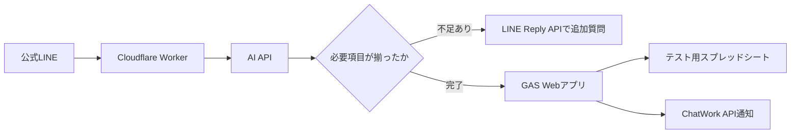

# 公式LINE AI連携 現状整理とテスト環境方針

作成日: 2026-05-28

## 目的

公式LINEで受けたチャット内容をAIで確認し、不足項目があれば自動返信で補完し、必要情報が揃ったらスプレッドシートへ分類記録する。対応完了時にはChatWork APIで通知する。

本番の家計簿LIFF、GAS、定時LINE配信に影響を出さないよう、まずテスト環境を分離して構築する。

## 前提

- 公式LINEは陣内さんと奥様専用で利用している
- Webhook URL は Cloudflare Worker に向いている
  - `https://yumekango.s-jinnouchi.workers.dev/`
- 家計簿集計のLIFFアプリが1つある
- LIFF、Cloudflare Worker、GAS Webアプリ、スプレッドシートが連携している
- GAS Webアプリは現在、ゆめ看護のGoogle Workspaceではなく個人Googleアカウント側で動いている
- `market-pilot` ではPythonとcronにより、株式分析結果を公式LINEへ定時送信している
- 今後の新規スプレッドシートは分離し、可能であれば `yumekango.com` 側で管理したい

## 現在確認できている構成

### Cloudflare Worker

リポジトリ上の対象:

- `yumekango-worker/worker.js`
- `yumekango-worker/wrangler.toml`

役割:

- `GET` で家計簿入力用のLIFF画面を返す
- GASの `action=getCategories` エンドポイントから家計簿カテゴリを取得する
- `POST` でLINE WebhookまたはLIFF送信内容をGAS Webアプリへ転送する

注意:

- 現在の `worker.js` は、GitHub上ではmultipart/form-dataの境界文字列を含んだ状態に見えるため、再デプロイ前に純粋なJavaScriptファイルとして整える必要がある
- GAS WebアプリURLとLIFF IDがコード内に直接書かれている

### GAS

ユーザー提供コードから確認した主な機能:

- `doGet`
  - `action=getCategories` の場合、家計簿カテゴリをJSONで返す
  - 通常アクセス時はLIFF用HTMLを返す
- `doPost`
  - `source: "liff"` の送信を家計簿シートへ保存する
  - LINE Webhookのテキストメッセージを処理する
  - `保管と入力` でメモ入力待ち状態に入り、`公式LINE_3` へ保存する
  - `情報参照` で `公式LINE_2` の項目をQuick Replyで返す
  - `家計簿入力開始` でLIFFボタンをFlex Messageで返す
  - `家計消化状況` で集計シートから家計状況をFlex Messageで返す
- 書き込み先:
  - 家計簿シート
  - 経費報告シート
  - `公式LINE_3`
- 参照先:
  - `公式LINE_2`
  - `集計`

注意:

- LINEチャネルアクセストークンがGASコードに直接書かれている
- スプレッドシートIDがGASコードに直接書かれている
- このMDにはトークン値や認証情報は記録しない

### market-pilot

リポジトリ上の対象:

- `market-pilot/scripts/06_daily_report.py`
- `market-pilot/docs/work_log.md`
- `market-pilot/CLAUDE.md`

役割:

- Pythonで株式市場の分析結果を作成
- cronで毎日 `07:00` と `22:30` に実行
- LINE Messaging APIのbroadcastで公式LINEへ送信

確認結果:

- cron設定済み
- 直近ログではLINE送信ステータス `200` を確認

注意:

- Pythonスクリプト側にもLINEトークンが直接書かれているため、将来的に環境変数化する

## 追加したい新システムの方針

本番の家計簿機能とは分けて、まず以下のテスト環境を作る。

1. テスト用スプレッドシートを新規作成
2. テスト用GAS Webアプリを新規作成
3. テスト用Cloudflare Workerまたは既存Worker内のテスト用ルートを作成
4. LINE Webhookから受けたメッセージをAI APIへ渡す
5. AIが必要項目の有無を判定する
6. 不足項目があればLINEで追加質問する
7. 必要項目が揃ったらスプレッドシートへ分類して保存する
8. ChatWork APIで陣内さんへ通知する

## 推奨アーキテクチャ



## テスト環境で分けるもの

- スプレッドシート
  - 本番家計簿とは別
  - 可能なら `yumekango.com` のGoogle Workspace側で作成
- GAS
  - 本番家計簿GASとは別
  - `Script Properties` にトークンやURLを保存
- Worker
  - 既存Workerに影響を出さないため、最初は別Workerまたはテスト用パスを推奨
- LINE応答フロー
  - 既存キーワードの `家計簿入力開始`, `家計消化状況`, `情報参照`, `保管と入力` と衝突しないトリガーにする

## 初期テスト: Kアラート・テスト開発

最初のAI連携テストは、公式LINEから受けた初回コメントを履歴として残し、AIが内容を分解して不足項目を聞き出す `Kアラート・テスト開発` とする。

### スプレッドシート

- タイトル: `Kアラート・テスト開発`
- 新規スプレッドシートとして作成する
- 本番家計簿とは分離する
- 可能であれば `yumekango.com` のGoogle Workspace側で作成する

### 列定義

| 列 | 項目 | 役割 |
|---|---|---|
| A | No | 連番 |
| B | 初回コメント内容 | 公式LINEで最初に受けたコメントを原文のまま転写 |
| C | いつ | AIが初回コメントまたは追加回答から抽出 |
| D | どこで | AIが初回コメントまたは追加回答から抽出 |
| E | だれが | AIが初回コメントまたは追加回答から抽出 |
| F | なにを | AIが初回コメントまたは追加回答から抽出 |
| G | どのように | AIが初回コメントまたは追加回答から抽出 |
| H | 緊急度 | AIまたはルールで判定 |
| I | 対応コメント | 対応者が後で記録、またはAIが下書き |
| J | やり取り全文記録 | 公式LINEでの初回コメントと追加質問・回答を時系列で保存 |
| K | 備考 | 補足、判断根拠、手動メモ |

### 公式LINE側の履歴保存ルール

- 初回コメント内容は、必ず `初回コメント内容` に原文のまま保存する
- AIが分解に失敗しても、初回コメントは失わない
- 追加質問と回答は `やり取り全文記録` に追記する
- 途中で不足項目が残った場合でも、行は保持する

### AI分解対象

AIは初回コメントを確認し、以下の5W1H系項目に分解する。

- `いつ`
- `どこで`
- `だれが`
- `なにを`
- `どのように`

### 不足時の自動応答方針

- 不足項目をまとめて聞く
- 聞き返しは短く、LINE上で返しやすい文面にする
- 既に分かっている項目は再質問しない
- 追加回答を受けたら、既存行の `やり取り全文記録` に追記し、空欄項目を埋める

例:

```text
記録しました。確認のため、次の点だけ教えてください。

1. いつの出来事ですか？
2. どこで起きましたか？
```

### 完了条件

- `いつ`
- `どこで`
- `だれが`
- `なにを`
- `どのように`

上記が揃ったら、記録完了として扱う。

次の段階で、`緊急度` の判定と `ChatWork API` への通知を追加する。

## セキュリティ課題

- LINEチャネルアクセストークンをGAS/ Pythonコードへ直書きしない
- ChatWork APIトークンをGitHubへ保存しない
- AI APIキーをGitHubへ保存しない
- GASでは `PropertiesService.getScriptProperties()` を使う
- Cloudflare Workerでは `wrangler secret` を使う
- 既にチャットやコードに露出したLINEトークンは、必要に応じてLINE Developersで再発行を検討する

## 未確認事項

- 新規テスト用スプレッドシートを `yumekango.com` 側で作成できるか
- `yumekango.com` 側GASで外部API呼び出し、Webアプリ公開、LINE返信が制限されないか
- ChatWork APIの利用対象ルームID
- `Kアラート・テスト開発` の具体的なトリガー文言
- `緊急度` の判定基準
- 既存Workerを分岐拡張するか、テスト用Workerを別名で作るか

## 次に決めること

1. `Kアラート・テスト開発` を開始するLINE上のトリガー文言
2. 不足時にLINEで聞き返す文面
3. 緊急度の選択肢と判定基準
4. ChatWork通知先のルーム
5. テスト用GASを `yumekango.com` 側で作るか、個人Googleアカウント側で先に作るか
