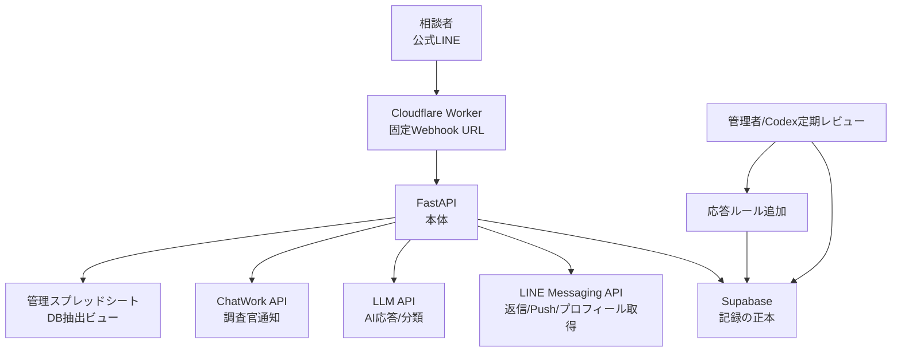
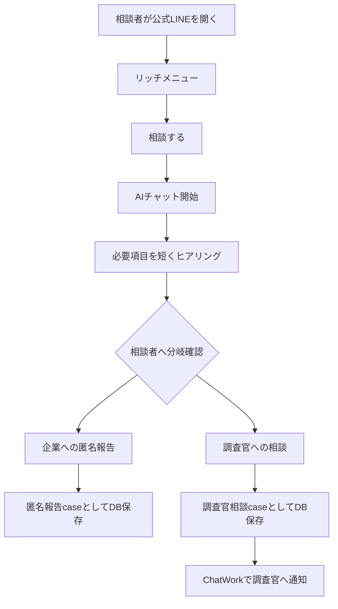
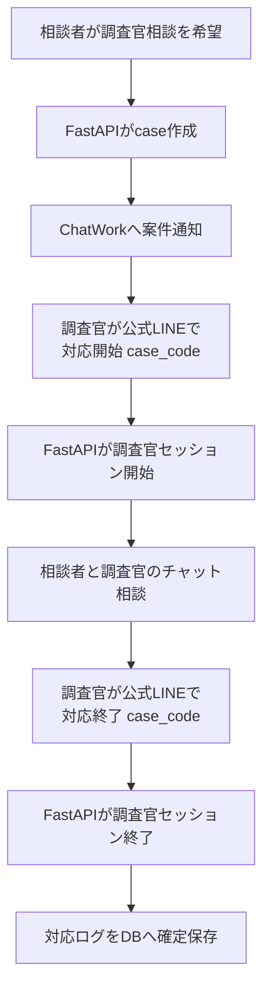
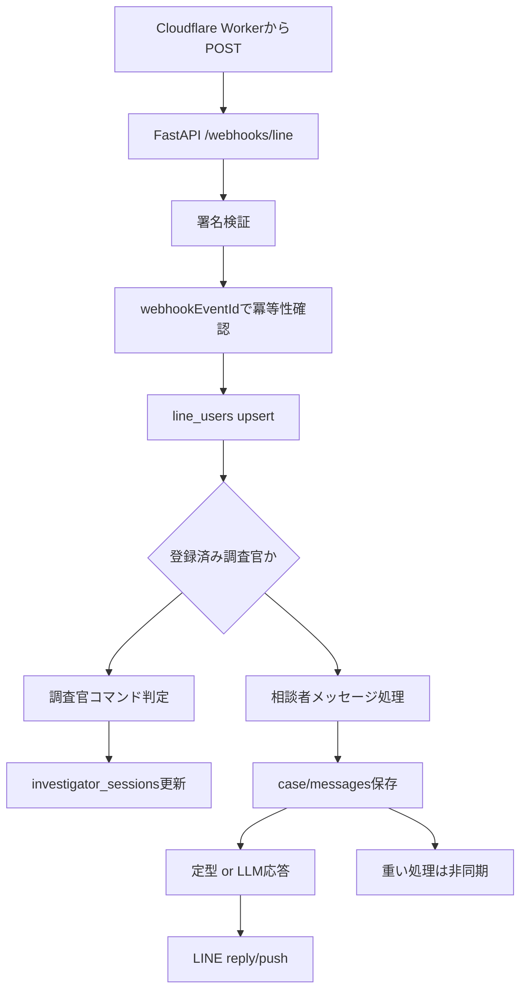

# Kアラート 本番開発 最終設計 v1

作成日: 2026-06-25

## 目的

Kアラートは、企業内のコンプライアンス、パワハラ、職場トラブルなどの相談をLINE公式アカウントで受け付ける本番システムである。

相談者は公式LINE上でAIとチャットし、内容と本人希望に応じて以下へ分岐する。

1. 企業への匿名報告
2. 警察OBなどの調査官へのチャット相談

本番版では、相談内容、AI応答、調査官対応、報告書作成に必要な記録をSupabase DBへ保存する。Googleスプレッドシートは正本ではなく、管理者が必要に応じてDBから抽出・確認する補助ビューとする。

## 基本方針

- テスト版はそのまま残し、本番版は新規構築する。
- Cloudflareは `yumekango.com` 側のアカウントを使う。
- 本番公式LINE、管理スプレッドシート、ChatWork、Supabaseはこれから新規作成する。
- Webhook URLは新規作成してよい。
- 一度LINE公式アカウントへ設定したWebhook URLは、以後なるべく変更しない。
- リッチメニュー画像は現状テスト版のものを転用する。
- AI応答は迅速性を優先する。
- 管理者は定期的にCodexで会話ログと応答ルールを確認し、新ルールを追加して運用品質を上げる。
- 秘密情報はコード、Markdown、GitHub、Notionに保存しない。

## 全体構成



Cloudflare Workerは固定Webhook URLとして使う。FastAPIのホスティング先が変わっても、LINE側Webhook URLは変更しない。

初期実装では、Cloudflare WorkerからFastAPIへ転送する。Worker Queueは最初から必須にしない。ただし将来的に重い処理や高負荷対策が必要になった場合に、Queueへ移行できる構成にする。

## 相談者フロー



AIが一方的に重大判断を確定しない。重要な分岐では、相談者に確認する。

例:

- 「この内容を企業への匿名報告として提出しますか？」
- 「調査官とのチャット相談を希望しますか？」

## 調査官相談フロー

管理者が依頼ボタンを押すのではなく、相談者が調査官相談を希望した場合に自動でChatWork通知する。



調査官はLINE userIdを事前登録する。

調査官判定は次のAND条件とする。

- 登録済み調査官のLINE userIdである。
- メッセージが行頭アンカー付き正規表現に一致する。
- case_codeが必須で含まれる。

例:

```text
対応開始 K-20260625-001
対応終了 K-20260625-001
```

初期版では、1人の調査官が同時にactiveな案件を複数持たない制約にする。複数案件同時対応は後続拡張とする。

## LINEユーザー識別

LINE Webhookの `source.userId` で、公式LINEアカウントに対するユーザー識別が可能。

ただし、LINE userIdはDB全体の外部キーにはしない。DB内部では `line_users.id` のUUIDを参照する。

`line_user_id` は `line_users` テーブルだけが保持する外部自然キーとする。

匿名報告ルートでは、匿名性との矛盾を避けるため、初期版では原則として `display_name` と `picture_url` は取得しない。将来、調査官相談や本人同意がある場合に限って取得できる設計余地を残す。

## 応答速度設計

LINEのreply tokenは有効期限が短く、1回のみ使用できる。そのため、AI応答は迅速性を優先する。

初期方針:

1. 定型応答はLLMを使わず即時返信する。
2. LLMを使う場合は、直近数件の会話と該当ルールだけを渡す。
3. タイムアウト時は安全な定型文を返す。
4. reply tokenが使えない、または処理が遅延した場合はpush messageへフォールバックする。
5. 要約、詳細分析、ルール候補作成、報告書下書きなどの重い処理は非同期化する。

初期実装ではFastAPI内のBackgroundTasksまたは軽量ジョブとして開始し、必要になったらCloudflare Queueや外部Queueへ拡張する。

## AI応答ルール

AI応答ルールは二層構造にする。

1. FastAPI固定ルール
2. Supabase可変ルール

FastAPI固定ルール:

- 相談者に過度な断定をしない。
- 緊急性が高い内容では安全側の案内を行う。
- 匿名報告と調査官相談の分岐確認を行う。
- 可変ルールより常に優先する。
- 個人情報を不必要に聞かない。

Supabase可変ルール:

- 運用で追加する応答ルール。
- 初期状態は `active=false`。
- 管理者レビュー後に有効化する。
- 固定ルールを上書きできない。
- Codex定期レビューで追加・改善する。

## Supabase DB設計

以下はv1の基本スキーマ方針。実装時はSQL migrationとして管理する。

### line_users

```text
id uuid primary key
line_user_id text unique not null
display_name text
picture_url text
is_active boolean not null default true
first_seen_at timestamptz
last_seen_at timestamptz
deleted_at timestamptz
created_at timestamptz not null default now()
updated_at timestamptz not null default now()
```

### investigators

調査官であることはこのテーブルの存在から判定する。`line_users.role` は持たない。

```text
id uuid primary key
line_user_id uuid unique not null references line_users(id)
name text not null
chatwork_room_id text
chatwork_account_id text
is_active boolean not null default true
notes text
deleted_at timestamptz
created_at timestamptz not null default now()
updated_at timestamptz not null default now()
```

### cases

```text
id uuid primary key
case_code text unique not null
line_user_id uuid not null references line_users(id)
route_type text not null
status text not null
ai_summary text
category text
urgency text
completed_at timestamptz
deleted_at timestamptz
created_at timestamptz not null default now()
updated_at timestamptz not null default now()
```

制約候補:

```text
route_type in ('undecided', 'anonymous_report', 'investigator_consultation')
status in ('open', 'collecting', 'waiting_investigator', 'in_consultation', 'completed', 'closed')
urgency in ('high', 'medium', 'low', 'unknown')
```

### webhook_events

LINE Webhookの冪等性を担保する。

```text
id uuid primary key
webhook_event_id text unique not null
line_user_id uuid references line_users(id)
event_type text
raw_payload jsonb not null
processed_at timestamptz
created_at timestamptz not null default now()
```

### messages

```text
id uuid primary key
case_id uuid references cases(id)
webhook_event_id text references webhook_events(webhook_event_id)
sender_type text not null
sender_line_user_id uuid references line_users(id)
channel text not null
body text
message_type text
raw_payload jsonb
created_at timestamptz not null default now()
```

制約候補:

```text
sender_type in ('user', 'ai', 'investigator', 'system')
channel in ('line', 'system', 'chatwork', 'admin')
```

### ai_extractions

```text
id uuid primary key
case_id uuid not null references cases(id)
when_text text
where_text text
who_text text
to_whom_text text
what_text text
how_text text
urgency text
notes text
model text
prompt_version text
created_at timestamptz not null default now()
```

### investigator_sessions

```text
id uuid primary key
case_id uuid not null references cases(id)
investigator_id uuid not null references investigators(id)
status text not null
start_keyword text
end_keyword text
started_at timestamptz not null default now()
ended_at timestamptz
created_at timestamptz not null default now()
updated_at timestamptz not null default now()
```

制約候補:

```text
status in ('active', 'ended', 'cancelled')
```

初期版では、同一 `investigator_id` に対して `status='active'` のセッションは1件のみとする。

### chatwork_notifications

```text
id uuid primary key
case_id uuid not null references cases(id)
investigator_id uuid references investigators(id)
room_id text not null
message_body text not null
chatwork_message_id text
status text not null
error_message text
sent_at timestamptz
created_at timestamptz not null default now()
```

制約候補:

```text
status in ('pending', 'sent', 'failed')
```

### ai_response_rules

```text
id uuid primary key
title text not null
trigger_type text not null
trigger_text text
instruction text not null
priority integer not null default 100
active boolean not null default false
approved_by text
approved_at timestamptz
created_at timestamptz not null default now()
updated_at timestamptz not null default now()
```

### rule_reviews

```text
id uuid primary key
reviewed_period_start timestamptz
reviewed_period_end timestamptz
summary text
proposed_rules jsonb
status text not null
created_by text
created_at timestamptz not null default now()
```

制約候補:

```text
status in ('draft', 'approved', 'rejected', 'applied')
```

### reports

```text
id uuid primary key
case_id uuid not null references cases(id)
report_type text not null
status text not null
body text
storage_url text
submitted_at timestamptz
deleted_at timestamptz
created_at timestamptz not null default now()
updated_at timestamptz not null default now()
```

制約候補:

```text
report_type in ('anonymous_report', 'consultation_report')
status in ('draft', 'reviewed', 'submitted', 'archived')
```

### audit_logs

```text
id uuid primary key
actor_type text not null
actor_id uuid
action text not null
target_table text
target_id uuid
metadata jsonb
created_at timestamptz not null default now()
```

## 推奨インデックス

```text
line_users(line_user_id)
cases(line_user_id)
cases(status)
cases(case_code)
messages(case_id, created_at)
messages(webhook_event_id)
webhook_events(webhook_event_id)
investigator_sessions(case_id)
investigator_sessions(investigator_id) where status = 'active'
ai_response_rules(active, trigger_type)
chatwork_notifications(case_id)
```

## FastAPI設計

初期エンドポイント案:

```text
GET  /health
POST /webhooks/line
POST /investigators/register
POST /investigator-sessions/start
POST /investigator-sessions/end
POST /chatwork/notify-investigator
GET  /admin/cases
GET  /admin/cases/{case_id}
GET  /admin/export/cases
POST /admin/rules
PATCH /admin/rules/{rule_id}
POST /admin/rule-reviews
```

`/internal/line/reply` は初期設計から外す。LINE返信はWebhook処理サービス内部の責務として実装する。将来、管理画面やジョブからLINE送信が必要になった場合に内部API化を検討する。

## LINE Webhook処理



## Cloudflare Worker設計

責務:

- LINEからの固定Webhook URLを提供する。
- FastAPIへPOSTを転送する。
- リクエストIDを付与する。
- FastAPIの内部URL変更を吸収する。
- FastAPI障害時のログを残す。

初期版ではWorker Queueは必須にしない。ただし、将来以下が必要になった場合はQueue化する。

- LLM処理遅延が多い。
- LINE reply token失効が頻発する。
- FastAPI障害時にWebhookイベントを保持したい。
- 通知やレポート生成をより確実に再試行したい。

## セキュリティ/匿名性

- LINE署名検証を行う。
- Supabase RLSを有効化する。
- service_role keyはサーバー側だけで使う。
- 相談本文を通常ログに出さない。
- `raw_payload` に秘密情報を保存しない。
- 匿名報告ルートでは表示名・画像を原則取得しない。
- 削除/匿名化のために主要テーブルへ `deleted_at` を持たせる。
- 報告書には個人特定情報を入れない設計を基本とする。
- DB本文暗号化は初期必須にしないが、将来の検討余地として残す。

## LLM障害時fallback

LLM APIがタイムアウト、失敗、レート制限になった場合:

- 相談内容はDBに保存する。
- 相談者には安全な定型文を返す。
- 緊急可能性のある文言は固定ルールで案内する。
- LLMの復旧後に非同期で要約/抽出する。

定型文例:

```text
内容を受け付けました。確認のうえ、必要に応じて追加でお伺いします。
```

## 初期実装範囲

最初に作るもの:

- Supabase SQL migration
- FastAPI雛形
- LINE Webhook受信
- 署名検証
- `webhookEventId` 冪等性
- LINE userId保存
- case作成
- messages保存
- AI応答ルール取得
- LLMクライアント抽象化
- ChatWork通知クライアント抽象化
- 調査官登録
- `対応開始 case_code` / `対応終了 case_code`
- 管理スプシ抽出用APIの土台
- `.env.example`
- README
- ユニットテスト

後回し:

- Cloudflare Queue
- PDF/Google Docs報告書生成
- 本文列暗号化
- 管理画面
- 複数調査官/複数案件同時対応の高度制御
- ルール候補自動生成

## 本番設定前に必要なもの

コードと設計レビュー後に作成/設定する。

- Supabase本番プロジェクト
- LINE公式アカウント
- LINE Developers Messaging APIチャネル
- ChatWork APIトークン/通知先ルーム
- 管理スプレッドシート
- Cloudflare Worker route/domain
- FastAPIホスティング先
- 必要な環境変数

## 最終判断

本番初期版は以下で進める。

```text
Cloudflare固定Webhook
→ FastAPI
→ Supabase正本
→ LINE返信
→ ChatWork調査官通知
→ 調査官LINE userId事前登録
→ 対応開始/終了ワードで相談ログ確定
→ スプレッドシートはDB抽出ビュー
```

Claudeレビューの重要指摘は採用する。ただし、Queue、本文暗号化、複数案件同時対応などは初期から重く作り込みすぎず、設計余地を残して段階導入する。

