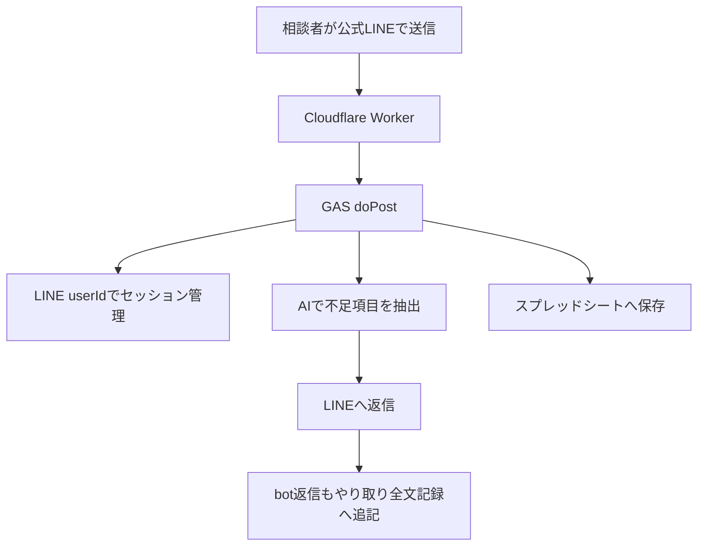
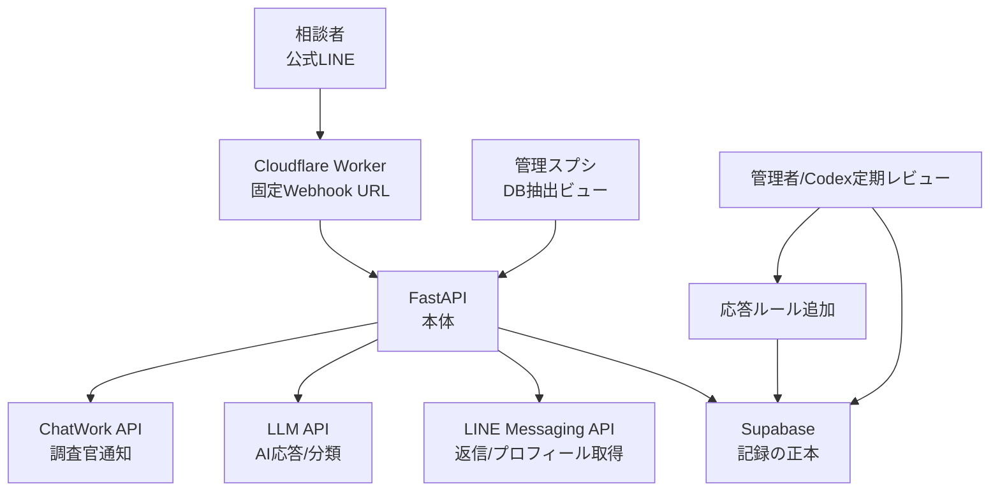
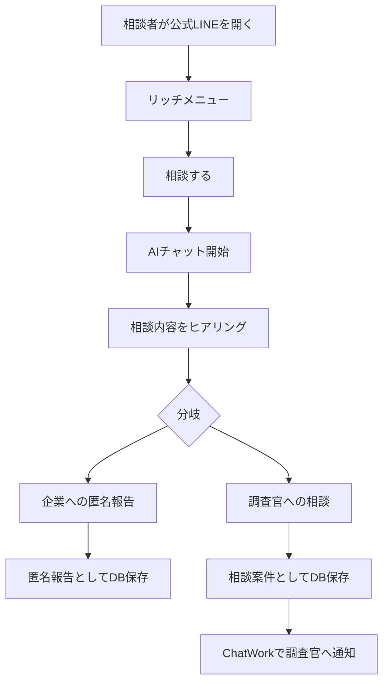
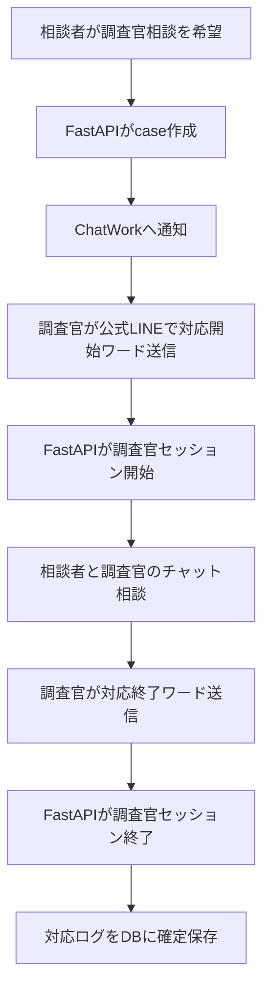

# Kアラート 本番開発 設計レビュー用ブリーフ

作成日: 2026-06-25

## 目的

Kアラートは、企業内のコンプライアンス、パワハラ、職場トラブルなどの相談をLINE公式アカウントで受け付けるシステムである。

相談者は公式LINE上でAIとチャットし、内容に応じて以下のどちらかへ分岐する。

1. 企業への匿名報告
2. 警察OBなどの調査官へのチャット相談

本番版では、相談内容、AI応答、調査官対応、報告書作成に必要な記録をSupabase DBへ保存する。スプレッドシートは正本ではなく、管理者が必要に応じてDBから抽出・確認するための補助ビューとする。

この文書は、Claude Opus 4.8などにDB設計とFastAPI基盤コードをレビューさせるための前提資料である。単に動くコードではなく、長期運用、保守性、個人情報/相談情報の扱い、応答速度、障害時の安全性を考慮した洗練された設計を期待する。

## 現在のテスト版

現在のテスト版は維持し、本番版の直接改修対象にしない。

テスト版の主な構成:

- LINE公式アカウント
- Cloudflare Worker
- Google Apps Script
- Googleスプレッドシート
- AI API

現在確認できているテスト版フロー:



テスト版GASで確認済みの考え方:

- `event.source.userId` によりLINEユーザー識別は可能。
- ただし現状のスプレッドシートには `userId` を列として保存していない。
- セッション管理には `CacheService` と `userId` を使っている。
- 相談内容をAIで `いつ`, `どこで`, `だれが`, `だれに`, `なにを`, `どのように`, `緊急度` に分解している。
- 不足項目があればLINEで短く聞き返す。
- bot返信も会話ログに残している。

## 本番版の前提

- 本番版は新規構築する。
- テスト版はそのまま残す。
- Cloudflareは `yumekango.com` 側のアカウントを使う。
- 公式LINEアカウント、Googleスプレッドシート、ChatWork、Supabaseはこれから本番用に作成する。
- Webhook URLは新規作成してよい。
- ただし一度LINE公式アカウントへ設定したWebhook URLは、今後なるべく変更不要にしたい。
- リッチメニュー画像は現状テスト版のものを転用する。
- AI応答はできるだけ迅速に返したい。
- 管理者は定期的にCodexでAIとのやり取りと既存応対ルールを確認し、新しい応答ルールを追加して運用改善したい。

## 推奨全体構成



Cloudflare Workerは固定入口として使う。FastAPIのホスティング先や内部構成が変わっても、LINE側Webhook URLは変えない。

## 相談者フロー



分岐は、相談者の選択、AIによる分類、または両方を併用する。

初期実装では、AIが勝手に重大判断を確定しすぎないように、重要な分岐は相談者への確認を挟む設計が望ましい。

例:

- 「この内容を企業への匿名報告として提出しますか？」
- 「調査官とのチャット相談を希望しますか？」

## 調査官相談フロー

管理者が手動で依頼するのではなく、相談者が調査官相談を希望した場合に自動でChatWork通知する。



調査官はLINE userIdを事前登録する。

公式LINE管理画面へのアクセス権があるユーザーをAPIで自動的に調査官判定する設計は避ける。LINE Messaging APIのWebhookで安定して取れるのは、公式LINEへメッセージを送ってきたユーザーのイベントであり、Official Account Managerの権限者一覧や管理画面操作ログをDB記録用の判定キーとして扱うのは難しいため。

調査官判定は以下の併用を推奨する。

- 登録済み調査官 `line_user_id`
- 対応開始ワード
- 案件ID
- 対応終了ワード

例:

```text
対応開始 K-20260625-001
対応終了 K-20260625-001
```

この間の登録済み調査官の発言を、該当caseの `investigator` メッセージとして保存する。

## AI応答ルール管理

AI応答ルールは二層構造にする。

1. FastAPI側の固定ルール
2. Supabase側の可変ルール

FastAPI側には、基本方針、安全制約、相談分岐、禁止事項、出力形式などの中核ルールを置く。

Supabase側には、運用で追加・改善する応答ルールを保存する。

管理者は定期的にCodexで会話ログと既存ルールを確認し、新しいルール候補を作成する。その後、承認済みルールだけを有効化する。

AI応答を速くするため、毎回すべての会話ログや全ルールをLLMへ渡さない。

推奨:

- FastAPIで先に軽量分類する。
- 該当する有効ルールだけDBから取得する。
- LLMへ渡すのは直近数件の会話と必要ルールだけにする。
- 定型応答はLLMを使わず即時返答する。
- DB保存、要約、分析、ルール候補作成などの重い処理は非同期にする。

## DB設計案

以下は初期案であり、Opus 4.8に正規化、インデックス、RLS、監査ログ、削除/匿名化方針、スケーラビリティの観点で添削してほしい。

### line_users

相談者、調査官、管理者候補など、LINE上で識別されるユーザー。

```text
id uuid primary key
line_user_id text unique not null
display_name text
picture_url text
role text not null default 'user'  -- user, investigator, admin
is_active boolean not null default true
first_seen_at timestamptz
last_seen_at timestamptz
created_at timestamptz not null default now()
updated_at timestamptz not null default now()
```

### investigators

調査官情報。`line_users` と分けることで、調査官固有の連絡先や稼働状態を管理する。

```text
id uuid primary key
line_user_id text unique not null references line_users(line_user_id)
name text not null
chatwork_room_id text
chatwork_account_id text
is_active boolean not null default true
notes text
created_at timestamptz not null default now()
updated_at timestamptz not null default now()
```

### cases

相談・報告の単位。

```text
id uuid primary key
case_code text unique not null
line_user_id text not null references line_users(line_user_id)
route_type text not null  -- undecided, anonymous_report, investigator_consultation
status text not null      -- open, collecting, waiting_investigator, in_consultation, completed, closed
ai_summary text
category text
urgency text              -- high, medium, low, unknown
created_at timestamptz not null default now()
updated_at timestamptz not null default now()
completed_at timestamptz
```

### messages

相談者、AI、調査官、システム通知の発言ログ。

```text
id uuid primary key
case_id uuid references cases(id)
sender_type text not null  -- user, ai, investigator, system
sender_line_user_id text
channel text not null      -- line, system, chatwork, admin
body text
message_type text          -- text, postback, image, file, etc.
raw_payload jsonb
created_at timestamptz not null default now()
```

### ai_extractions

AIが相談内容から抽出した項目。最新版だけでなく履歴を残せるようにする。

```text
id uuid primary key
case_id uuid not null references cases(id)
when_text text
where_text text
who_text text
to_whom_text text
what_text text
how_text text
urgency text
notes text
model text
prompt_version text
created_at timestamptz not null default now()
```

### investigator_sessions

調査官が案件対応を開始してから終了するまでのセッション。

```text
id uuid primary key
case_id uuid not null references cases(id)
investigator_id uuid not null references investigators(id)
status text not null       -- active, ended, cancelled
start_keyword text
end_keyword text
started_at timestamptz not null default now()
ended_at timestamptz
created_at timestamptz not null default now()
updated_at timestamptz not null default now()
```

### chatwork_notifications

調査官通知の送信履歴。

```text
id uuid primary key
case_id uuid not null references cases(id)
investigator_id uuid references investigators(id)
room_id text not null
message_body text not null
chatwork_message_id text
status text not null       -- pending, sent, failed
error_message text
sent_at timestamptz
created_at timestamptz not null default now()
```

### ai_response_rules

運用で追加するAI応答ルール。

```text
id uuid primary key
title text not null
trigger_type text not null     -- keyword, category, situation, escalation, safety
trigger_text text
instruction text not null
priority integer not null default 100
active boolean not null default false
approved_by text
approved_at timestamptz
created_at timestamptz not null default now()
updated_at timestamptz not null default now()
```

### rule_reviews

Codex等で定期レビューした結果と、ルール追加候補。

```text
id uuid primary key
reviewed_period_start timestamptz
reviewed_period_end timestamptz
summary text
proposed_rules jsonb
status text not null       -- draft, approved, rejected, applied
created_by text
created_at timestamptz not null default now()
```

### reports

企業へ提出する匿名報告書または相談対応報告書。

```text
id uuid primary key
case_id uuid not null references cases(id)
report_type text not null  -- anonymous_report, consultation_report
status text not null       -- draft, reviewed, submitted, archived
body text
submitted_at timestamptz
created_at timestamptz not null default now()
updated_at timestamptz not null default now()
```

### audit_logs

管理操作、ルール変更、抽出、報告書更新などの監査ログ。

```text
id uuid primary key
actor_type text not null   -- system, admin, codex, investigator
actor_id text
action text not null
target_table text
target_id text
metadata jsonb
created_at timestamptz not null default now()
```

## FastAPI設計案

初期エンドポイント案:

```text
GET  /health
POST /webhooks/line
POST /internal/line/reply
POST /investigators/register
POST /investigator-sessions/start
POST /investigator-sessions/end
POST /chatwork/notify-investigator
GET  /admin/cases
GET  /admin/cases/{case_id}
GET  /admin/export/cases
POST /admin/rules
PATCH /admin/rules/{rule_id}
POST /admin/rule-reviews
```

LINE Webhookの基本処理:

1. Cloudflare WorkerからFastAPIへ転送される。
2. LINE署名検証はFastAPI側で行う。Worker側でも可能なら補助的に行う。
3. `source.userId` を取得する。
4. `line_users` をupsertする。
5. 登録済み調査官かどうか判定する。
6. 調査官開始/終了ワードなら `investigator_sessions` を更新する。
7. 相談者メッセージなら、caseへ紐づけて `messages` に保存する。
8. 必要な場合のみLLMを呼ぶ。
9. LINEへ返信する。
10. 重い処理はバックグラウンドタスクまたはキューへ回す。

## Cloudflare Worker設計案

Cloudflare Workerは固定Webhook URLとして使う。

責務:

- LINEからのPOSTを受ける。
- FastAPIへ転送する。
- FastAPIの内部URLが変わっても、LINE側URLを変えずに済むようにする。
- 可能であればリクエストIDを付与する。
- LINEには安定してHTTP 200を返す設計を検討する。
- ただし、FastAPI側のエラーを完全に隠すと障害検知が難しくなるため、ログと監視設計が必要。

## レビューしてほしい観点

Opus 4.8には、特に以下をレビューしてほしい。

1. DB設計
   - 正規化しすぎ/不足がないか。
   - 相談ログ、調査官ログ、AI抽出、報告書の関係が適切か。
   - インデックス設計。
   - Supabase RLS方針。
   - 個人情報、匿名化、削除、監査ログの設計。

2. FastAPI設計
   - LINE Webhook処理の責務分離。
   - 署名検証。
   - 非同期処理。
   - 返信速度。
   - LLM API障害時のfallback。
   - ChatWork API障害時のretry。
   - テストしやすい構成。

3. AI応答設計
   - 相談者に過度な断定をしない。
   - 重大/緊急/違法可能性のある相談の安全な案内。
   - 企業への匿名報告と調査官相談の分岐。
   - 可変ルールを安全に反映する仕組み。
   - プロンプト肥大化を避けた高速応答設計。

4. 調査官対応設計
   - 登録済み調査官LINE userIdによる判定。
   - 対応開始/終了ワードの誤爆防止。
   - 複数案件を同時に扱う場合の設計。
   - 相談者と調査官の会話ログの正確な紐づけ。

5. 運用
   - 本番アカウント作成前にどこまでモックで検証すべきか。
   - `.env.example` と実シークレットの分離。
   - ローカル開発、ステージング、本番の分離。
   - 管理スプシへのDB抽出方式。

## 初期実装で作るべきもの

本番アカウント作成前に、まず以下をモック可能な形で作る。

- Supabase SQL schema
- FastAPIプロジェクト雛形
- LINE Webhook受信処理
- LINE userId保存
- AI応答ルール取得ロジック
- LLMクライアント抽象化
- ChatWork通知クライアント抽象化
- 調査官登録
- 対応開始/終了ワード処理
- messages保存
- `.env.example`
- README
- テスト

本番値はまだ入れない。

## 未確定事項

- FastAPIの本番ホスティング先。
- Supabaseプロジェクト名、リージョン、RLS詳細。
- 本番LINE公式アカウントのチャネル情報。
- ChatWork通知先のルーム設計。
- 管理スプシのGoogleアカウントと抽出権限。
- 報告書をDB内テキストに留めるか、Google Docs/PDFまで生成するか。

## 期待するコード品質

- ドメインロジック、外部APIクライアント、DBアクセス、Webhookハンドラを分離する。
- LINE/ChatWork/LLM/Supabaseを直接ベタ書きせず、テスト可能なインターフェースにする。
- `raw_payload` は保存するが、秘密情報を保存しない。
- 相談情報を扱うため、ログ出力に本文や個人情報を不用意に流さない。
- LLM障害時も相談者に最低限の安全な応答を返す。
- 返信速度を優先し、重い処理は非同期化する。
- ルール追加やプロンプト変更の履歴を追えるようにする。
- 将来、管理画面やスプシ抽出を追加しやすい構成にする。

