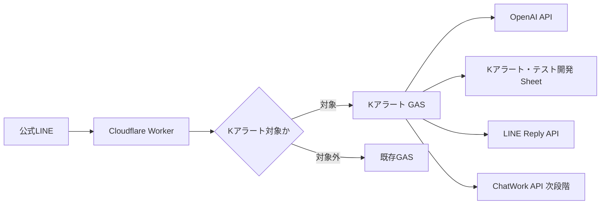

# Kアラート・テスト開発

公式LINEに投稿された初回コメントをAIで分解し、不足項目をLINEで聞き返し、最終的にスプレッドシートへ記録するテスト開発プロジェクトです。

## 目的

- 公式LINEのチャット内容を履歴として残す
- 初回コメントを `いつ・どこで・だれが・なにを・どのように` に分解する
- 不足項目があれば公式LINEで自動質問する
- 必要項目が揃ったら `Kアラート・テスト開発` スプレッドシートへ保存する
- 次段階でChatWork API通知を追加する

## 本番影響を避ける方針

- 既存の家計簿LIFF、GAS、スプレッドシートとは分離する
- 既存の株式分析LINE通知とは分離する
- 公式LINEのWebhookは既存Cloudflare Workerに向いているため、Kアラートだけを新GASへルーティングする
- 秘密情報はGitHubに保存しない

## 構成

```text
k-alert-test/
├── README.md
├── AGENTS.md
├── docs/
│   ├── implementation_plan.md
│   ├── manual_setup.md
│   ├── sheet_schema.md
│   └── work_log.md
├── gas/
│   ├── Code.gs
│   └── appsscript.json
└── worker/
    ├── worker.js
    └── wrangler.toml.example
```

## 初期アーキテクチャ



## 開発ステップ

1. `yumekango.com` 側でテスト用スプレッドシートを作成
2. テスト用GASを作成し、`gas/Code.gs` を貼り付け
3. GASのScript Propertiesへ各種ID/APIキーを設定
4. Webアプリとしてデプロイ
5. WorkerにKアラートルーティングを追加
6. 公式LINEで `Kアラート ...` を送信して動作確認
7. 不足項目の聞き返し品質を調整
8. ChatWork通知を追加

## 秘密情報の扱い

以下はGitHubへ保存しません。

- LINEチャネルアクセストークン
- LINEチャネルシークレット
- OpenAI APIキー
- ChatWork APIトークン
- GAS WebアプリURL
- スプレッドシートID

